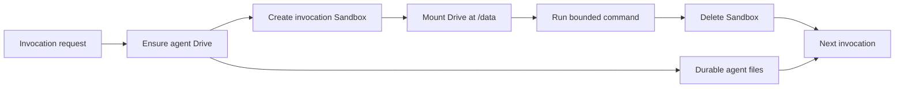

# Architecture

Durable files belong to the agent. Compute belongs to the invocation.

The architecture isolates the lifecycle decision from the Blaxel SDK calls. `BoundedLifecycle` owns ordering and cleanup. `BlaxelRuntimeAdapter` translates those operations into Drive, Sandbox, mount, process, and deletion calls.

## Core invariants

1. The Drive name is deterministic per agent.
2. The Sandbox name is deterministic per agent and invocation.
3. The Drive and Sandbox use the same region.
4. Existing Drive labels and permissions are reconciled before use.
5. A Sandbox is ready before its Drive is mounted.
6. Command execution starts only after the mount is visible.
7. Synchronous execution is capped at 60 seconds and uses `keepAlive: true`, so the process is stopped at its timeout.
8. Cleanup runs after success, command failure, or timeout.
9. Every Sandbox has a maximum-age TTL as a backstop to explicit deletion. It is measured from creation, not from the last activity.
10. A configuration fingerprint prevents a same-name retry from reusing stale image, environment, network, or credential configuration.
11. A command failure and a cleanup failure remain visible together.

## Resource ownership

| Resource           | Owner        | Default lifecycle in this recipe       |
| ------------------ | ------------ | -------------------------------------- |
| Agent Drive        | Agent        | Persists across invocations            |
| Sandbox            | Invocation   | Deleted after execution                |
| Workload command   | Application  | Supplied by the caller                 |
| Blaxel credentials | Orchestrator | Never copied into the workload command |

## Failure behavior

- Drive creation failure stops before Sandbox creation.
- Sandbox creation failure leaves no usable compute to clean up.
- Mount failure triggers Sandbox deletion.
- Command failure or timeout still triggers Sandbox deletion.
- A transient `WORKLOAD_UNAVAILABLE` response is retried with bounded exponential backoff for readiness, lookup, mount verification, and deletion.
- `WORKLOAD_NOT_FOUND` during deletion counts as successful cleanup.
- Command execution is not automatically retried because a lost response does not prove that the command never started.

## Why this recipe deletes the Sandbox

Blaxel Sandboxes can persist in standby and resume with their filesystem and processes intact. That is the better choice when a workload benefits from retaining the full machine state.

This recipe externalizes durable files to Agent Drive and treats the Sandbox as one invocation's compute boundary. Deletion removes the prior invocation's in-memory state, environment, and process tree. The tradeoff is losing standby resume speed and paying the startup cost for each invocation.

Choose the lifecycle that matches the workload. The cookbook demonstrates one bounded pattern, not the only Blaxel Sandbox lifecycle.

## Optional application hardening recipes

The core interfaces allow applications to add reviewed workload selection, credential injection, network policy, custom images, external telemetry, distributed ownership, and durable cleanup reconciliation independently. These layers are application choices rather than prerequisites for Agent Drive.

See [optional application hardening recipes](../recipes/README.md) for their contracts, separate dependencies, and limitations.
